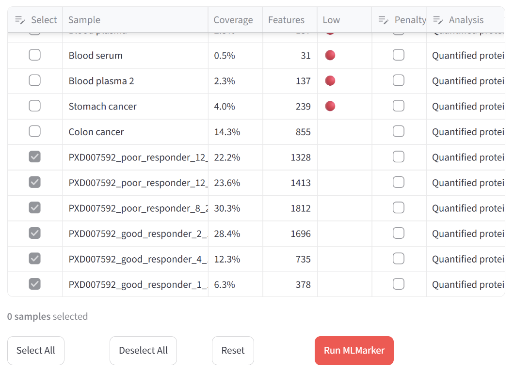
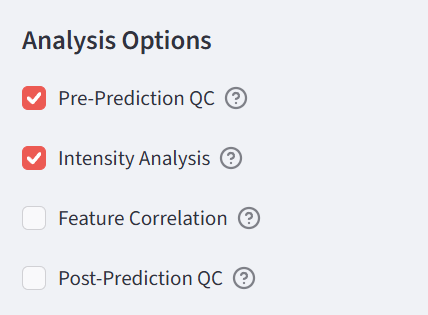
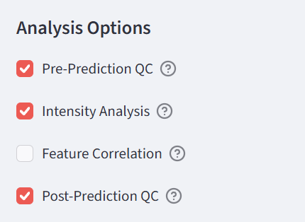
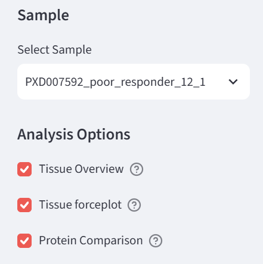
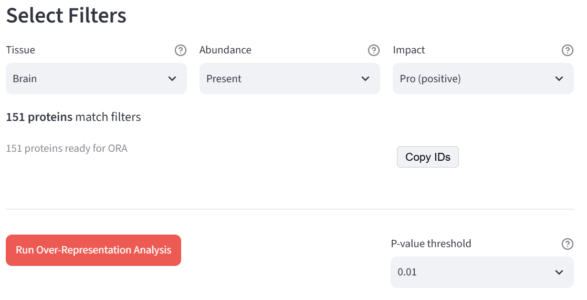

# Tutorial: cerebral melanoma brain biopsies (PXD007592)

This tutorial walks through the MLMarker app using six real samples from PXD007592: brain excisions from cerebral melanoma patients, split into poor and good responders to treatment. This data was also used in the MLMarker paper, and we'll roughly replicate the paper's results.

> Zila *et al*. analysed proteomic profiles of cerebral melanoma metastases to grasp the difference between good and poor treatment response to MAP kinase inhibitors (MAPKi). The samples were obtained through surgical excision, and response state to MAPKi treatment was determined through progression-free survival (PFS). Good responders had a PFS ≥ 6 months and low disease progression, while poor responders had a PFS < 3 months and fast disease progression. The authors observed small molecular differences between good and poor responders, with poor responders exhibiting an epithelial-mesenchymal transition (EMT) signature and drug resistance mechanisms, while good responders showed higher immune activation. To note is that this different response to treatment was determined on a phenotypic level and not on the proteotype of the tumour. Ultimately, the authors associated good response patients with proliferative melanoma tumours and poor response patients with invasive melanoma tumours, but, at 1% false discovery rate (FDR) and a Perseus s₀ of 0.5, could only identify fourteen differentially expressed proteins between the two response states.

Read the full publication here: [doi:10.1186/s13059-026-04125-8](https://doi.org/10.1186/s13059-026-04125-8)

Each question is numbered (**Q1**, **Q2**, ...). Answers are collected in a separate file, [ai-for-biological-interpretation-answers.md](ai-for-biological-interpretation-answers.md). Many items in the app have tooltips. Read them by hovering over the question mark icons. Often they will help you towards the right answer.

> [!TIP]
> Any chart in the app can be exported as a PNG via the camera icon in its top-right corner.

## Before you start: what is MLMarker actually doing?

You don't need a machine learning background for this tutorial, but a few concepts come up on almost every page.

**The model and its feature space.** MLMarker was trained on reference samples from 34 tissues and cell types, and during training it settled on a fixed list of about 5,979 proteins it pays attention to. Think of it like a targeted panel assay rather than an open-ended one: whatever else your sample contains, only the overlap with this list of ~5,979 proteins actually feeds the model. That overlap, expressed as a percentage, is what the app calls **coverage**. A shotgun DDA run of a solid tissue will typically hit a good chunk of that list; a shallow run or a biofluid sample (plasma, urine) where a handful of highly abundant proteins dominate will hit far less of it.

**SHAP values.** The underlying classifier is a tree ensemble, and its raw output alone doesn't tell you *why* it made a call. SHAP (SHapley Additive exPlanations) breaks that decision back down per protein: each protein gets a signed score for each tissue, telling you how much it pushed the prediction toward that tissue (positive, "pro") or away from it (negative, "con"). Add up every protein's score for a tissue and you get that tissue's total prediction score. A **force plot** is just a bar chart of the biggest pro and con contributors for one tissue.

One detail that matters a lot later: a protein doesn't need to be *present* to get a SHAP score. If a protein is absent from your sample, that absence itself can be informative, and it will show up with its own SHAP value, positive or negative. You'll see this play out directly in section 5.

**The penalty factor.** Missing proteins are treated as zero. For a solid tissue biopsy that's usually fine, a missing protein is genuinely informative. For sparse sample types (biofluids, cell lines, organoids) a large fraction of the panel is missing for purely technical reasons (low input, depletion, dynamic range), and letting the model lean hard on all those zeros can distort the result. The penalty factor down-weights missing proteins to correct for that.

With that vocabulary in place, let's load some data.

## 1. Loading the data

Meet Mark, the octopus guiding you through the app. He'll pop up with comments throughout; feel free to ignore him, though he occasionally says something useful.

Browse to [mlmarker.streamlit.app](https://mlmarker.streamlit.app/) to get started.

On the Home page, click **Try Example Data**. This loads a table of quantified proteins from several samples, formatted the way MLMarker expects: rows are samples, columns are proteins (UniProt IDs), values are relative abundances. You can upload your own data the same way, as CSV, TSV, or XLSX, with the same layout.

For this tutorial we'll use the last six samples in the table (the ones starting with PXD007592). Select **Multiple samples** as the analysis mode, then use the checkboxes in the first column to select the bottom six rows.

***Q1**: MLMarker feature coverage varies quite a bit across these six samples, roughly 6% to 30%. Does any of them get flagged with a red dot in the "Low" column, and would you turn on the penalty factor for them?*

Now **Run MLMarker** on the six selected samples. When it's ready, click on **View Heatmap**.

***Q2**: The result heatmap already shows a clear trend. What stands out?*

## 2. Quality control

Move to the **QC** page by clicking on it in the left sidebar. It's the densest page in the app, but the checkboxes on the left let you pick which analyses to look at. The question this whole page is built around: is a prediction driven by real biology, or could it just as easily be explained by technical differences between samples (how much protein went in, how deep the run went)? A wet-lab equivalent would be checking a loading control before you trust a difference in band intensity on a western blot.

Enable **Intensity Analysis** by checking its box in the sidebar. It compares the intensity carried by MLMarker's ~5,979 proteins against the set of all proteins detected in the sample. If a prediction is driven by biology, that MLMarker-vs-rest proportion should look similar across samples regardless of which tissue they're predicted as. That holds here. If it didn't, and the proportion swung wildly between predicted groups, it would suggest these samples sit too far outside the model's training distribution for the prediction to be trustworthy, a case of out-of-distribution use of the model.

Now enable **Post-Prediction QC** to see how these technical metrics line up against the actual predictions.

- **Fig A** (total intensity): very close across samples, so all predictions rest on a comparable amount of measured protein, with the ovary- and monocyte-predicted samples only slightly higher.
- **Fig B** (MLMarker features intensity): non-brain predictions lean on somewhat higher-intensity proteins than the brain predictions do.
- **Fig C** (MLMarker feature coverage): clearly lower for the ovary- and monocyte-predicted samples, meaning that MLMarker's predictions for those samples are based on less proteins.

***Q3**: Putting Figs A to C together, what does this tell you about the non-brain-predicted samples specifically?*

## 3. Visualizations

The **Visualizations** page zooms into one sample at a time and shows which proteins are actually driving its tissue prediction, in which direction, using the SHAP values (see above). Toggle the checkboxes on the left one at a time; if the page gets slow, turn some off.

Start with *poor_responder_12_1*, which has a very high brain prediction.

***Q4**: What is its second-highest predicted tissue? Does that make biological sense?*

Open the **Tissue force plot** and generate one for *brain*.

Remember from section 0 that this is just the biggest pro (green) and con (red) contributors for that tissue, stacked by SHAP magnitude, like a tug-of-war where each protein pulls the prediction toward or away from Brain.

> [!IMPORTANT]
> Both the presence and the absence of a protein can serve as *both* pro and con evidence for MLMarker's prediction. In other words, a strongly positive SHAP magnitude does not necessarily mean that a high abundance of a protein led to MLMarker's prediction, it could also be that its absence is very predictive of the predicted tissue.

Now generate the same plot for *pituitary gland* and compare the two.

***Q5**: Comparing the two force plots, what do you observe?*

Switch to *good_responder_1_1*, which was predicted as *monocyte* instead of *brain*, a "wrong" call for a brain biopsy sample.

***Q6**: Compare its monocyte force plot with its brain force plot. What happens? Pay special attention to the top pro protein for both tissue predictions.*

## 4. Protein Explorer

Go to the **Protein Explorer** page and switch to *good_responder_1_1* in the sidebar. It's the same SHAP-driven protein list as the force plot, but as a searchable, filterable table: by **tissue**, by **abundance** (present or absent in this sample), and by **impact** (pro or con SHAP values). You can also search by protein name/ID or paste in your own protein list. A statistics panel at the bottom summarizes everything that is currently filtered.

Select the monocyte prediction, filter to **Absent** abundance, and leave impact on **All**.

You'll get well over a thousand contributing proteins, almost all of them positive. These are proteins that are *not detected* in this sample, and whose absence the model reads as evidence in favor of monocytes; so green in the force plot of section 3, but not present in the sample. Seems like MLMarker's prediction of *monocyte* is almost entirely based on the absence of proteins.

***Q7**: Recall from Q1 that this sample sat at 6.3% coverage, just above the 5% cutoff for the automatic warning. Given what you're seeing here, how could you balance this out?*

Search for **P98160**.

***Q8**: What is this protein, and how does it end up supporting a monocyte call?*

## 5. Functional Analysis

This page runs Over-Representation Analysis (ORA) through g:Profiler: given a list of proteins, it asks whether they show up together in known biological processes, pathways, or components more often than you'd expect by chance. If a protein list is genuinely biologically coherent, ORA should return a focused set of related terms; if it's a grab bag, it won't.

***Q9**: Of the 714 proteins contributing positively to the brain prediction, 151 are present and 563 are absent. Is it surprising that so many absent proteins contribute positively?*

We'll run two ORAs at p < 0.01: one on the present proteins, one on the absent ones. Watch not just the number of terms, but what kind of terms come back.

Ensure *poor_responder_12_1* is selected in the sidebar. Uncheck the box for **Use proteins from Protein Explorer**, filter on **Brain**, **Present**, and **Pro**, click **Run Over-Representation Analysis**, then tick the boxes for **Results table** and **visualization** in the sidebar to investigate the results.

***Q10**: What does the ORA on the 151 present proteins give you?*

To run ORA on the absent proteins, filter on **brain**, **absent**, and **Pro**, and click **Run Over-Representation Analysis** again.

***Q11**: And on the 563 absent proteins? More terms or fewer than you'd expect, and does the pattern match your expectations from Q9?*

## 6. Comparative Analysis

Move to the **Comparison** page, which runs analyses across all six samples together rather than one at a time.

Start with the **tissue probability heatmap**, an overview of every sample's prediction across all 34 tissues at once. Use the sort options (top tissue, or hierarchical clustering) if the default sample order makes the pattern hard to read.

Open **PCA Analysis** (sidebar check) and cluster samples by protein abundance (try both "All Proteins" and "MLMarker Features" modes). Poor responders, all sharing a strong brain signal, cluster tightly together; good responders are more scattered, because "not brain" can look like several different things (monocyte here, something else there) rather than one shared alternative signature.

***Q12**: Now switch the PCA mode to **Tissue-Specific SHAP** and select Monocytes. This clusters the samples on SHAP values for the selected tissue prediction instead of simple protein abundances. What changes?*

Now open **Group Comparison**, split the six samples into poor responders and good responders, and look at the Mann-Whitney U test for Brain. This test is used here instead of a t-test because it doesn't assume the values are normally distributed, which matters when you only have three samples per group, far too few to check normality at all.

***Q13**: The test reports U = 9 and p = 0.1, not significant at the usual p < 0.05 threshold, even though the two groups are visually about as separated as they could possibly be. Why?*

> [!TIP]
> Feel free to also try **Sample Comparison** and **Top Tissue Summary** on this page for a more direct, sample-by-sample view of the same six profiles.

## 7. Going further

To close, go back to the Home page and re-run the analysis with the penalty factor enabled for the two lowest-coverage samples, good_responder_1_1 (6.3%) and good_responder_4_1 (12.3%), the same fix you reasoned your way to in Q7. See how much their tissue predictions shift once missing proteins are down-weighted instead of counted at full strength against them, and whether that changes the overall poor-vs-good-responder pattern from Q2.
